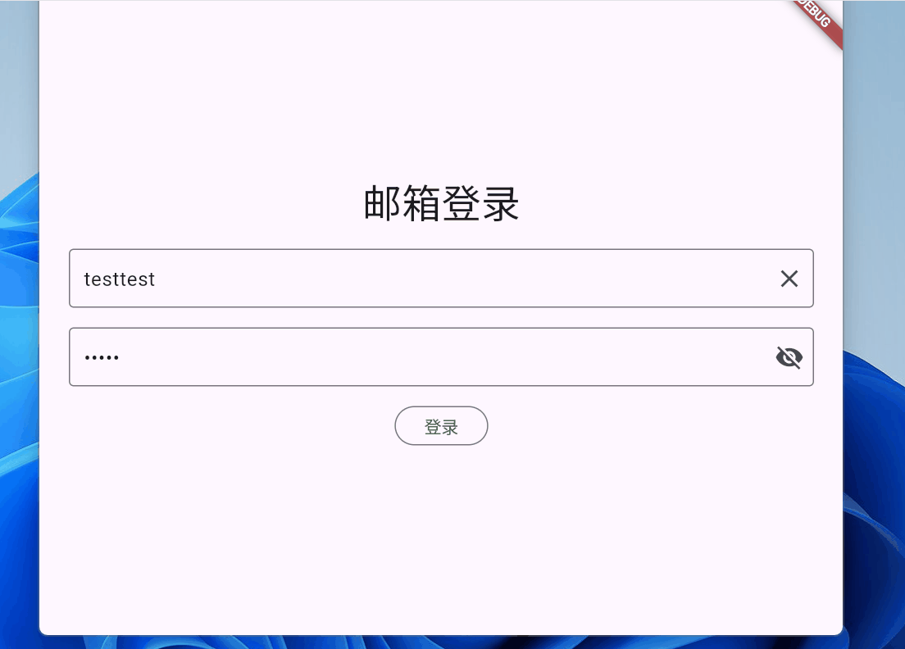
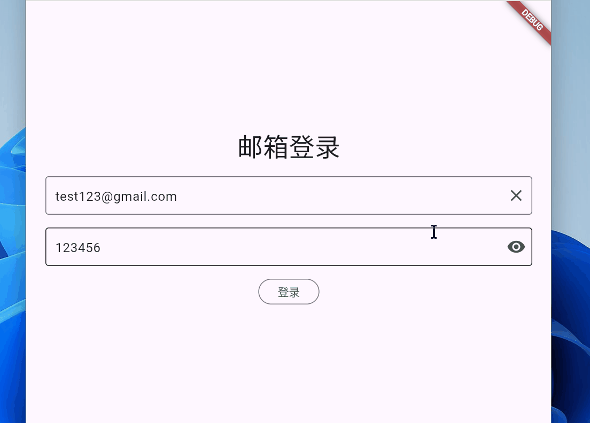

# Flutter Sign In Demo with Python Backend

## Project Overview

This is a **Flutter + Riverpod sign-in example** with complete frontend-backend interaction, featuring the following:

* **Frontend**:
  * Uses **Flutter + Riverpod** for state management (`SignInState` / `AuthState` / `ToastState`), and adopts the MVVM architecture to achieve high decoupling of the data layer, business layer, and UI layer, featuring excellent maintainability and scalability.
  * Custom **Dio interceptors** to handle:
    * Network exceptions
    * Business exceptions (e.g., incorrect password)
  * Manual implementation of login form validation:
    * Email format validation
    * Password length ≥ 6 characters
  * Displays **Loading** state during login process
  * Shows custom **Toast** notifications for errors upon failure
  * Automatically navigates to homepage after successful login

* **Backend**:
  * Provides API (`/signin`) using **Python Flask**
  * Simple user information verification
  * Returns JSON data including status code, message, user data, etc.

* **Features**:
  * Complete frontend-backend communication
  * Elegant exception handling
  * Easy to extend (token + persistent login will be added in the next version)

## Technology Stack

| Frontend                          | Backend             |
| --------------------------------- | ------------------- |
| Flutter                           | Python Flask        |
| Riverpod (State Management)       | Flask REST API      |
| Dio (HTTP & Interceptors)         | JSON Response Format|
| Flutter Custom Toast (Error Hints)| -                   |
| Validation (Email & Password Length) | -                 |

## Function Demonstration

1. **Form Validation**

   * Empty email or password → No response when clicking the "Sign In" button
   * Invalid email format → Displays hint
   * Insufficient password length → Displays hint

2. **Login Process**

   * Enter correct account and password → Show Loading → Login successful → Navigate to homepage
   * Enter incorrect password → Show corresponding error Toast

3. **Exception Handling**

   * Network exception → Show Toast
   * Business exception → Show error message returned by backend

## Screenshot Preview

Login Failed

Login Successful

## Future Plans

* Persist user login information (token + shared_preferences / secure_storage)
* Auto-login functionality
