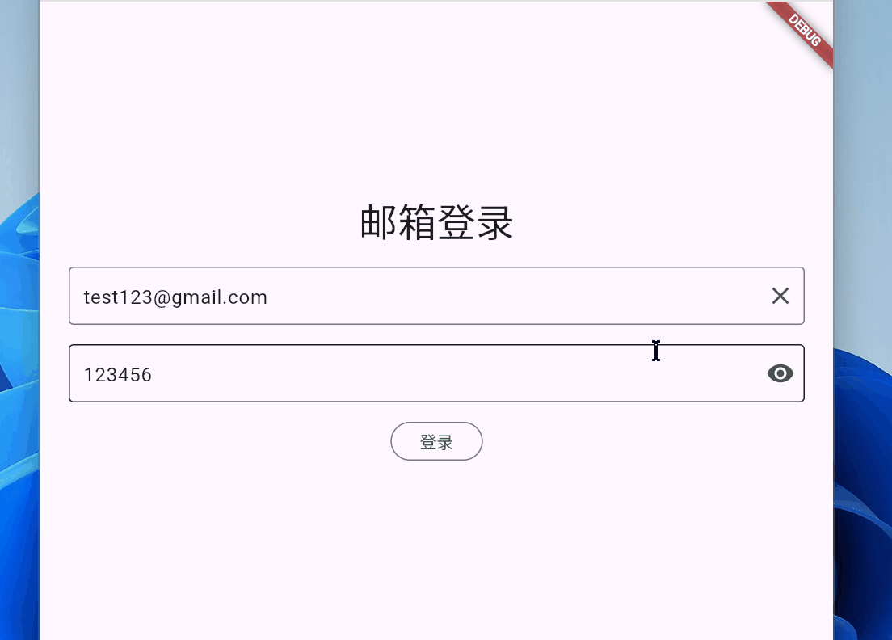

# Flutter Sign In Demo with Python Backend

## 项目概述

这是一个 **Flutter + Riverpod 的登录示例**，包含完整前后端交互，特点如下：

* **前端**：
  * 使用 **Flutter + Riverpod** 管理状态 (`SignInState` / `AuthState` / `ToastState`)，采用 MVVM 架构 实现数据层、业务层与 UI 层的高度解耦，具备良好的可维护性与扩展性。
  * 自定义 **Dio 拦截器**，处理：
    * 网络异常
    * 业务异常（如密码错误）
  * 手动实现登录表单验证：
    * 邮箱格式验证
    * 密码长度 ≥ 6
  * 登录过程中显示 **Loading**
  * 失败时弹出自定义的 **Toast** 提示，对应返回的错误
  * 登录成功后自动跳转到主页面

* **后端**：
  * **Python Flask** 提供接口 (`/signin`)
  * 简单校验用户信息
  * 返回 JSON，包括状态码、信息、用户数据等

* **特点**：
  * 完整前后端通信
  * 异常处理优雅
  * 易扩展（下个版本将加入 token + 持久化登录）

## 技术栈

| 前端                          | 后端             |
| --------------------------- | -------------- |
| Flutter                     | Python Flask   |
| Riverpod (状态管理)             | Flask REST API |
| Dio (HTTP & 拦截器)            | JSON 返回结构      |
| Flutter Custom Toast (错误提示)        | -              |
| Validation (邮箱 & 密码长度) | -              |

## 功能展示

1. **表单验证**

   * 邮箱或密码为空 → 点击“登录”按钮无反应
   * 邮箱格式错误 → 显示提示
   * 密码长度不足 → 显示提示

2. **登录流程**

   * 输入正确账号和密码 → 显示 Loading → 登录成功 → 跳转首页
   * 输入错误密码 → 显示对应错误 Toast

3. **异常处理**

   * 网络异常 → 显示 Toast
   * 业务异常 → 显示后端返回的错误信息

## 截图预览

登录失败

登录成功

## 下一步计划

* 持久化用户登录信息（token + shared_preferences / secure_storage）
* 自动登录功能
